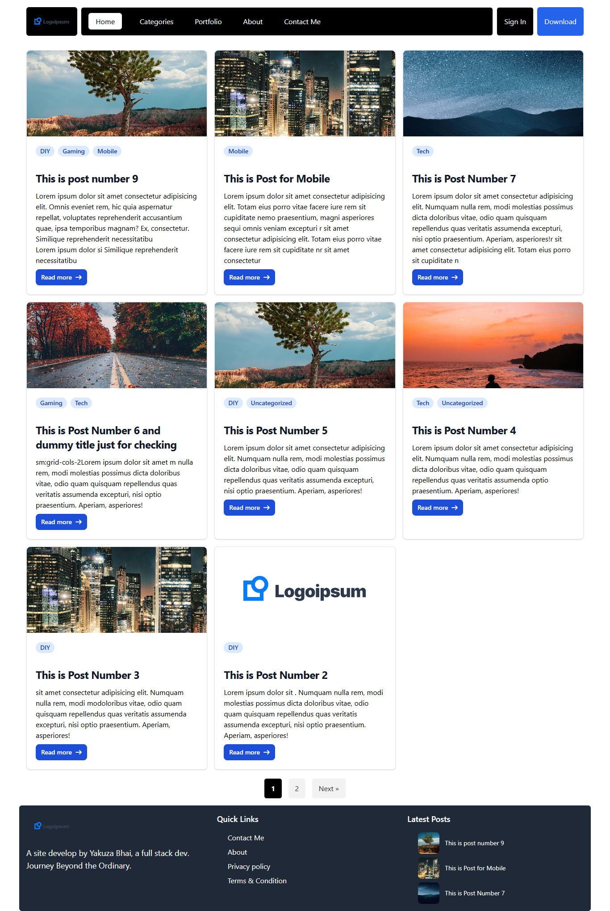
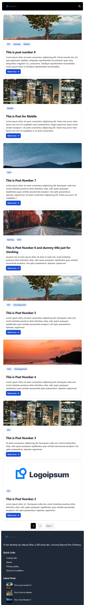
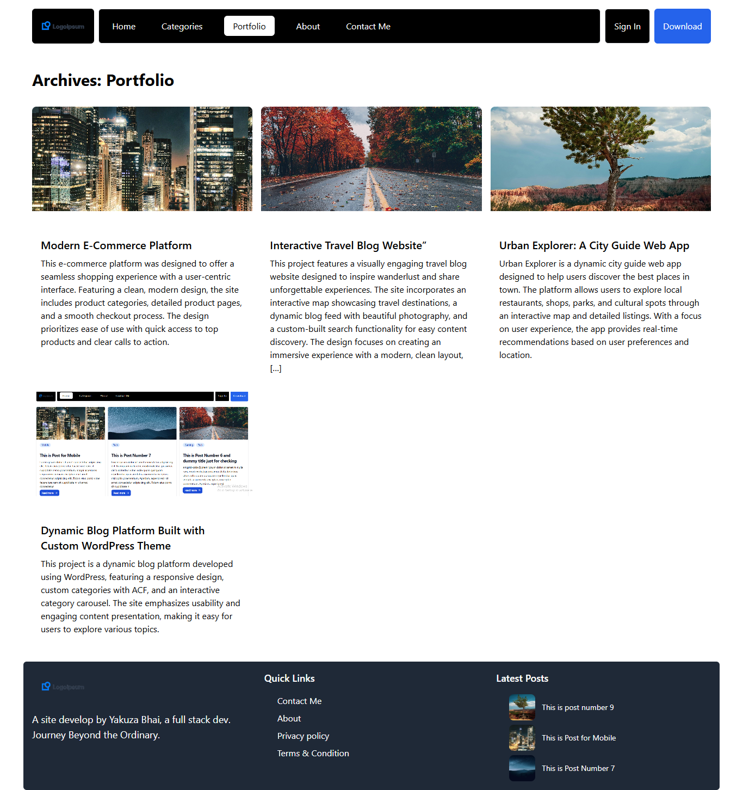
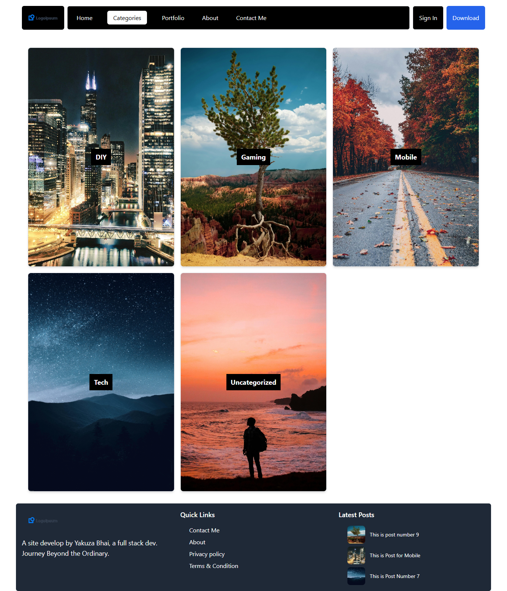

# WordPress Custom Theme Project

## Project Overview

This project is a custom-built WordPress theme designed to offer a clean, modern, and user-friendly experience for showcasing content such as blog posts, portfolios, and categories. The theme incorporates a fully responsive layout with a strong focus on design aesthetics, usability, and performance. The theme has been developed using a combination of PHP, HTML, CSS (Tailwind CSS), and custom fields (via ACF or Secure Custom Fields - SCF) to create a rich and dynamic website experience.

## Key Features

- **Responsive Design**: The theme is fully responsive, ensuring a seamless experience across desktop, tablet, and mobile devices. Media queries and Tailwind CSS utilities are used to handle responsiveness.

- **Custom Post Types**: A custom post type (CPT) for portfolios has been integrated. This allows users to display individual projects with custom fields such as project description, image galleries, and more.

- **Category Grid**: Categories are dynamically displayed in a grid with images and descriptions, offering a visually appealing way to explore different content types. The category images are added using the ACF plugin, which allows administrators to easily upload images for each category.

- **Custom Fields Integration**: Using Advanced Custom Fields (ACF) or Secure Custom Fields (SCF), the theme includes a custom image field for WordPress's built-in categories, allowing each category to have a unique image associated with it, which can be displayed dynamically on category archive pages.

- **Post Pagination**: Pagination is implemented using `the_posts_pagination()` to ensure users can easily navigate through multiple pages of blog posts or portfolios.

- **Custom Logo Support**: The theme supports custom logos with flexible dimensions, and fallback to the site title if no logo is provided.

- **Widgetized Footer**: The footer area is widgetized, allowing dynamic content such as recent posts and quick links to be added easily.

- **Custom Menu Locations**: Two custom menus are supported—one for the primary navigation and one for the footer.

## Technologies Used

- **WordPress**: The theme is built for WordPress, making use of WordPress’s theme development structure and API.

- **PHP**: Used for the logic of the theme, including the custom post types, category display, pagination, and other dynamic content.

- **Tailwind CSS**: Tailwind CSS is used for styling, providing utility-first classes to style components quickly and efficiently.

- **JavaScript (for mobile menu)**: A small JavaScript file is used to handle the mobile menu toggle for better user experience on smaller devices.

- **Advanced Custom Fields (ACF) / Secure Custom Fields (SCF)**: Custom fields are added to portfolio items and categories for more detailed content management.

## Installation

### Requirements:
- A running WordPress installation.
- A web server with PHP support (e.g., Apache or Nginx).
- MySQL database or equivalent.
- Tailwind CSS configured in the theme (via a build process).

### Steps:

1. **Clone or Download**: Clone or download the theme folder and place it in the `wp-content/themes/` directory of your WordPress installation.

2. **Activate the Theme**: Go to the WordPress admin dashboard, navigate to **Appearance > Themes**, and activate the theme.

3. **Install ACF**: Install and activate the Advanced Custom Fields plugin from the WordPress plugin repository. This will enable the custom fields for the categories and portfolio post types.

4. **Set up Category Images**: Go to the **Categories** section in WordPress, and for each category, use ACF to upload images.

---

## Images

Here are some visual examples of the theme in action:

- **Responsive Design**

      
    *Web View Example*

      
    *Tablet View Example*

      
    *Mobile View Example*

- **Custom Post Types (CPT) for Portfolios**

      
    *Custom Portfolio Post Type Example*

- **Category Grid and Custom Images from ACF**

      
    *Category Page with Custom Images from ACF*

- **Single Post Type**

      
    *Single Post Page Example*

---